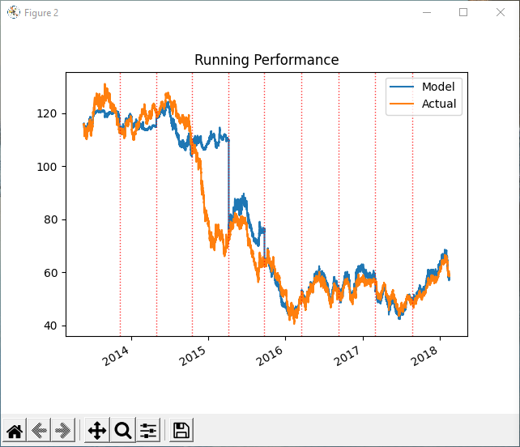
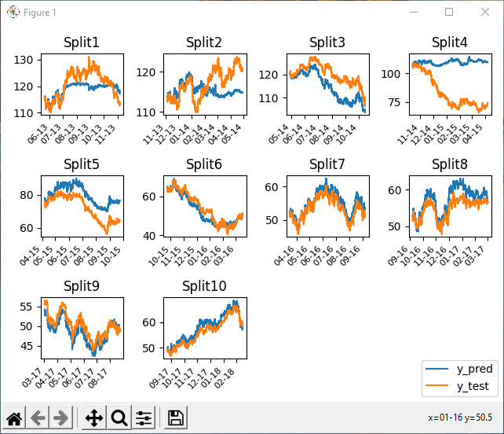

##Introduction
This is a collection of machine learning models and templates for analysis of time series data. 

Algorithms used: LSTM, Artificial Neural Networks, xgBoost, Support Vector Regression, Ridge/Lasso.

Logic includes code to perform time series splits and walk forward cross validation to help guard against over fitting
and improve likelihood of model performance in live practice. 

##Screenshots

<b>Running Performance:</b>

<b>Time Series Split Plot:</b>

